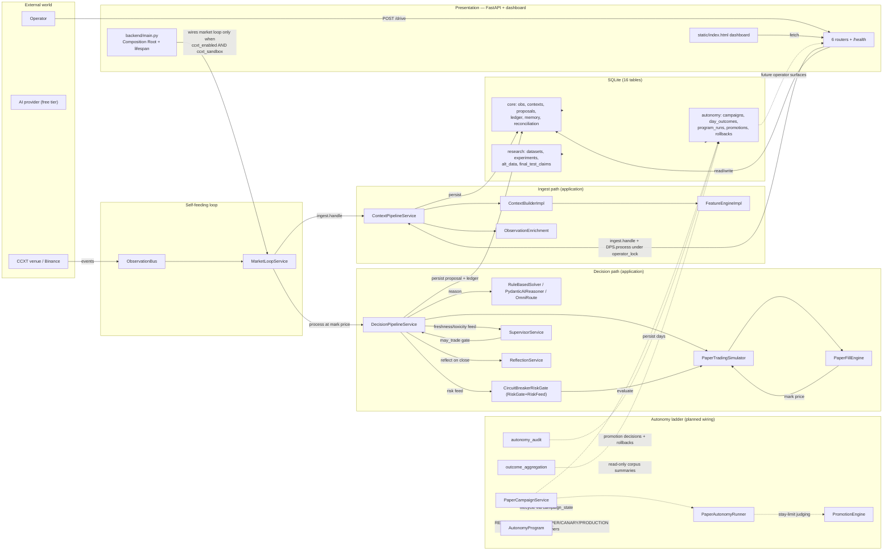
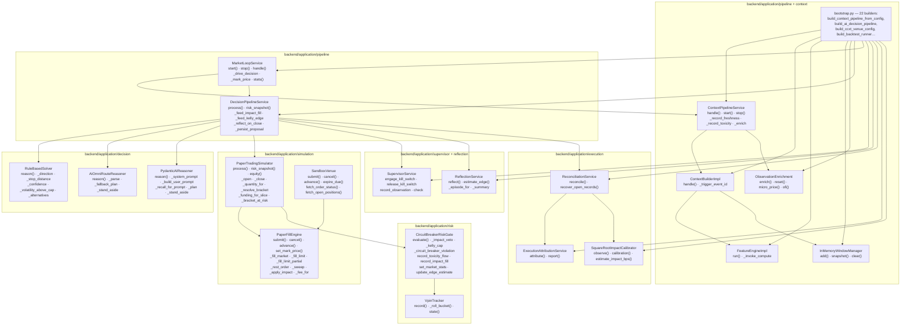
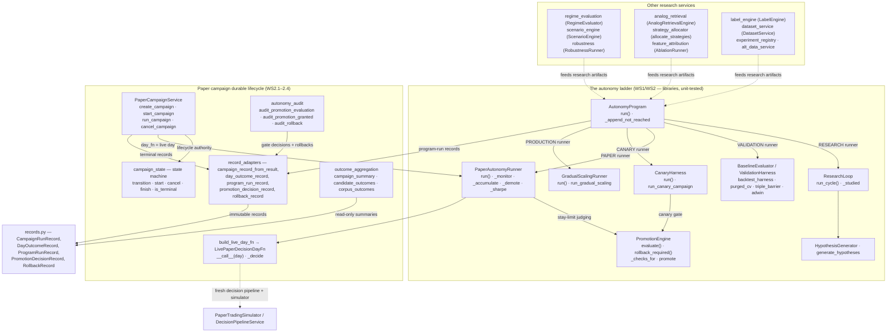
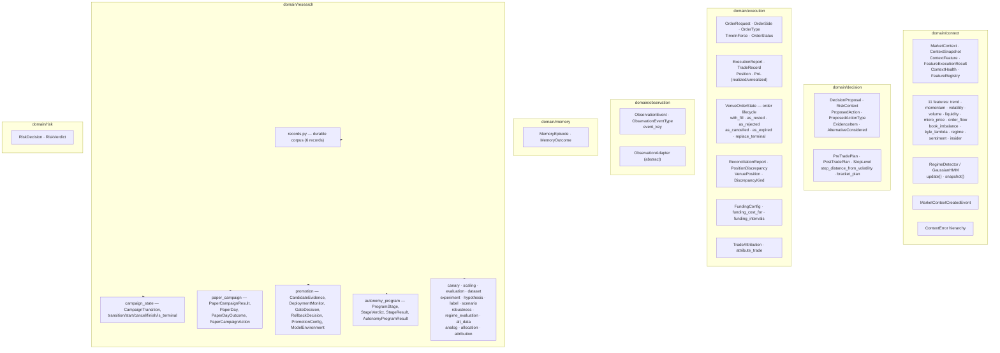
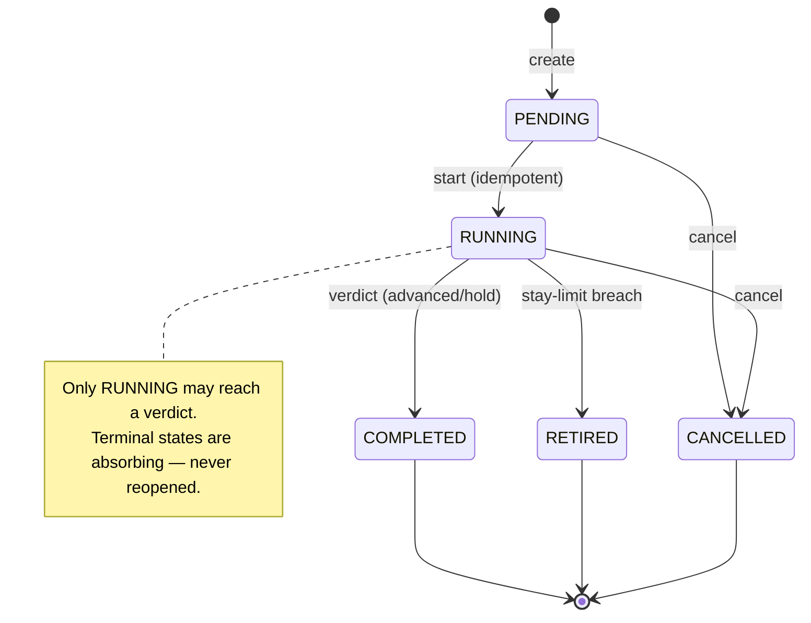
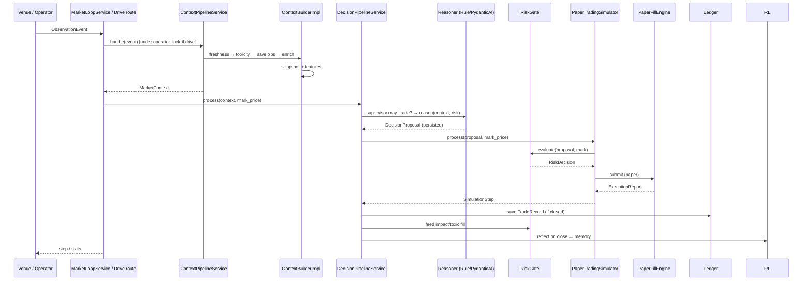

# ATI Engineering Diagrams — Full System Map

Every module, class, function, API endpoint, table, and integration in the
Autonomous Trading Intelligence, with the actual wires between them (verified
against `backend/main.py` composition root and the port contracts). Renders as
Mermaid in GitHub, GitLab, VSCode, or mermaid.live.

Legend
- Solid `-->` — real call/data edge present in the code.
- Dashed `-.->` — planned/not-yet-wired (exists as a library, not composed).
- `(planned)` — the autonomy ladder is unit-tested but not wired into `main.py`.

---

## 1. Master system flow



---

## 2. Presentation layer — every endpoint

```mermaid
flowchart TB
    APP["FastAPI app<br/>lifespan: builds repos, risk gate, simulator,<br/>pipelines, operator_lock, optional market loop"]
    AUTH["verify_api_key (API-key security on all routers)"]

    subgraph R_CONTEXT["routes_context.py (prefix=/v1, tags=observability)"]
        L1["GET /context/latest"]
        L2["GET /context/history"]
        L3["GET /events/recent"]
    end
    subgraph R_DECISION["routes_decision.py (prefix=/v1)"]
        L4["GET /proposals/recent"]
        L5["GET /proposals/{id}"]
        L6["GET /ledger/recent"]
        L7["GET /ledger/open"]
        L8["GET /ledger/attribution"]
        L9["GET /ledger/{id}"]
        L10["GET /simulator"]
    end
    subgraph R_DRIVE["routes_drive.py (prefix=/v1/drive)"]
        L11["POST /drive — build TRADE event,<br/>ingest.handle → set_mark_price →<br/>pipeline.process under operator_lock"]
    end
    subgraph R_MEM["routes_memory.py (prefix=/v1)"]
        L12["GET /memory/count"]
        L13["GET /memory/recall"]
        L14["POST /reflection/reflect"]
    end
    subgraph R_RECON["routes_reconciliation.py (prefix=/v1/reconcile)"]
        L15["POST /reconcile"]
        L16["POST /reconcile/sandbox"]
        L17["GET /reports"]
        L18["GET /count"]
    end
    subgraph R_SUP["routes_supervisor.py (prefix=/v1/supervisor)"]
        L19["GET /status"]
        L20["POST /kill"]
        L21["POST /release"]
    end
    subgraph R_ROOT["backend/main.py root"]
        L22["GET /health"]
        L23["GET /context/config"]
    end

    APP --> AUTH
    APP --> R_CONTEXT --> L1 & L2 & L3
    APP --> R_DECISION --> L4 & L5 & L6 & L7 & L8 & L9 & L10
    APP --> R_DRIVE --> L11
    APP --> R_MEM --> L12 & L13 & L14
    APP --> R_RECON --> L15 & L16 & L17 & L18
    APP --> R_SUP --> L19 & L20 & L21
    APP --> L22 & L23
    APP --> DASH["static dashboard mounted last"]
```



---

## 3. Application layer — pipelines, risk, simulation



---

## 4. Research / autonomy ladder (all harnesses)



---

## 5. Domain layer — models and state machines



---

## 6. Infrastructure layer — SQLite + adapters + 16 tables

```mermaid
flowchart TB
    DB["Database<br/>initialize() · connection() · lock() · close()"]

    subgraph REPOS["SQLite repositories"]
        OB["SqliteObservationRepository — save/find_recent/count"]
        CTX["SqliteContextRepository — save/latest/history"]
        PRP["SqliteProposalRepository — save/find_by_id/find_recent/count"]
        LED["SqliteLedgerRepository — save/find/open/closed/count"]
        MEM["SqliteMemoryRepository — record/recall/count"]
        REC["SqliteReconciliationRepository — save_report/recent/count"]
        DS["SqliteDatasetRepository — append_version/list/latest/load/list_datasets"]
        EX["SqliteExperimentRepository — save/get/list/set_status/record_result/claim_final_test"]
        ALT["SqliteAltDataRepository — save_event/snapshot_at/event_count"]
        AUT["SqliteAutonomyStore — 14 methods:<br/>save/get/list campaigns, set_status,<br/>day outcomes, program runs,<br/>promotion decisions, rollbacks"]
    end

    subgraph OBSADAPT["Observation + execution adapters"]
        OBUS["ObservationBus — bounded 1024<br/>subscribe/processed_count/latency"]
        CCXT["CcxtObservationAdapter — normalize<br/>_normalize_trade/_ticker/_order_book<br/>compute_order_book_delta"]
        BIN["BinanceAdapter — normalize"]
        GW["CcxtOrderGateway — submit/cancel<br/>fetch_open_positions/fetch_order_status<br/>_assert_live_safe (live gating)"]
        EBUS["InMemoryEventBus"]
    end

    subgraph CONF["Config"]
        SET["settings (pydantic Settings)"]
        CL["load_context_settings — _parse_window_duration<br/>_parse_features · _validate_feature_parameters"]
        CC["CcxtVenueConfig"]
    end

    subgraph TABLES["16 SQLite tables"]
        T1["observation_events"]
        T2["market_contexts"]
        T3["decision_proposals"]
        T4["trade_ledger"]
        T5["memory_episodes"]
        T6["reconciliation_reports"]
        T7["dataset_versions"]
        T8["dataset_records"]
        T9["experiments"]
        T10["final_test_claims"]
        T11["alt_data_events"]
        T12["autonomy_campaigns"]
        T13["autonomy_day_outcomes"]
        T14["autonomy_program_runs"]
        T15["autonomy_promotion_decisions"]
        T16["autonomy_rollbacks"]
    end

    DB --> OB & CTX & PRP & LED & MEM & REC & DS & EX & ALT & AUT
    OB & CTX & PRP & LED & MEM & REC & DS & EX & ALT & AUT --> T1 & T2 & T3 & T4 & T5 & T6 & T7 & T8 & T9 & T10 & T11 & T12 & T13 & T14 & T15 & T16
    OBUS --> CCXT
    OBUS --> BIN
    GW -->|venue calls| CCXT
    SET --> CL
    SET --> CC
    CC --> CCXT
    CC --> GW
```



---

## 7. Campaign state machine (WS2.1)



---

## 8. Live decision path — one event (sequence)



---

## 9. Dependency direction & layer rules

```
Presentation → Application → Domain ← Infrastructure
                    ↑                ↑
                    └────────────────┘
   (application depends on domain types + port interfaces;
    infrastructure implements the ports against SQLite/CCXT)
```

- **Domain** imports nothing from application/infrastructure — pure, immutable,
  JSON-serializable, no time/storage sources.
- **Application** orchestrates via injected ports (`AIReasoner`, `RiskGate`,
  `AutonomyStore`, …); contains no thresholds it does not own.
- **Infrastructure** implements ports; the composition root
  (`backend/main.py`) is the only place objects are constructed.
- **State machines are pure** — `campaign_state` never persists; the caller
  applies a clock and writes the transition.

## Drift

This map is generated by inspection of the composition root, route tables, DB
schema, and service contracts. When you change a boundary, edge, endpoint, or
table, update this file in the same change.
