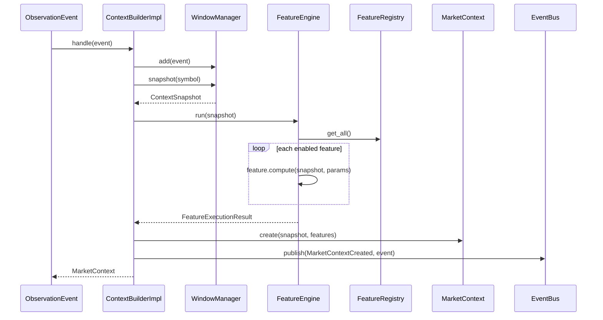

# Sprint 4A – Architecture Overview

## Purpose

Sprint 4A implements the **Context Builder** layer: transforming raw observation events into immutable, feature-enriched market context suitable for downstream reasoning.

## Layer Responsibilities

```
┌─────────────────────────────────────────────────────────────┐
│                     Presentation Layer                       │
│  FastAPI (health, config status, startup validation)        │
└─────────────────────────────────────────────────────────────┘
                              │
┌─────────────────────────────────────────────────────────────┐
│                    Application Layer                         │
│  ContextBuilderImpl  │  FeatureEngineImpl  │  WindowManager  │
│  bootstrap           │  interfaces         │  impl           │
└─────────────────────────────────────────────────────────────┘
                              │
┌─────────────────────────────────────────────────────────────┐
│                      Domain Layer                            │
│  MarketContext │ ContextSnapshot │ ContextFeature            │
│  FeatureRegistry │ FeatureExecutionResult │ ContextHealth    │
│  features/ (Trend, Momentum, Volatility, Volume, Liquidity) │
│  events/ (MarketContextCreatedEvent)                          │
└─────────────────────────────────────────────────────────────┘
                              │
┌─────────────────────────────────────────────────────────────┐
│                   Infrastructure Layer                       │
│  context_loader │ InMemoryEventBus │ config/context.yaml     │
└─────────────────────────────────────────────────────────────┘
```

## Sequence Diagram



## Responsibility Matrix

| Component | Owns | Does NOT Own |
|-----------|------|--------------|
| `ContextBuilderImpl` | Pipeline orchestration | Feature logic, AI, risk |
| `InMemoryWindowManager` | Rolling event windows per symbol | Feature computation |
| `FeatureEngineImpl` | Feature execution scheduling | Individual feature math |
| `FeatureRegistry` | Registration, ordering, deps | Computation |
| `TrendFeature` etc. | Deterministic feature values | Window management |
| `context_loader` | YAML validation | Runtime mutation |
| `InMemoryEventBus` | Event publication | Business logic |
| `MarketContext` | Immutable context state | Mutation |

## Dependency Direction

```
Infrastructure → Application → Domain
```

Domain models never import from application or infrastructure.

## Configuration Flow

```
config/context.yaml
       │
       ▼
context_loader.load_context_settings()
       │
       ▼
ContextSettings (immutable)
       │
       ├──► InMemoryWindowManager
       ├──► FeatureEngineImpl
       └──► FastAPI startup validation
```

## Thread Safety

| Component | Mechanism |
|-----------|-----------|
| `InMemoryWindowManager` | `threading.RLock` |
| `FeatureRegistry` | `threading.RLock` |
| `InMemoryEventBus` | `threading.RLock` |
| Domain models | Immutable (`frozen=True`) |

## Replaceability

| Component | Can Be Replaced With |
|-----------|---------------------|
| `InMemoryWindowManager` | Redis-backed window store |
| `InMemoryEventBus` | Redis pub/sub |
| Feature classes | New deterministic or ML features |
| `context.yaml` | Remote config service |
